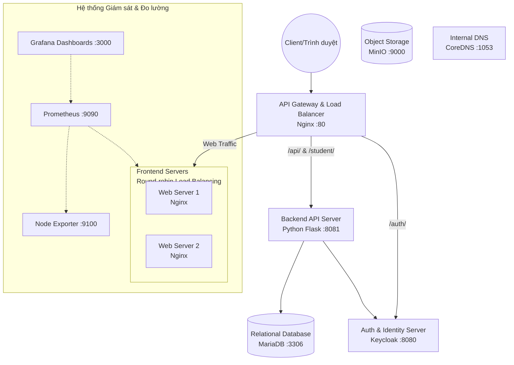

# MyMiniCloud - Mini Cloud Project

## 1. Mô tả dự án
**MyMiniCloud** là một hệ thống kiến trúc Microservices mô phỏng một môi trường Cloud thu nhỏ, được triển khai và tự động hóa thông qua Docker Compose. Dự án này bao gồm đa dạng các dịch vụ được container hóa nhằm cung cấp giải pháp toàn diện từ phục vụ web tĩnh, xử lý API, quản lý định danh người dùng, lưu trữ dữ liệu có cấu trúc và phi cấu trúc, đến việc giám sát hệ thống (Monitoring) và định tuyến nội bộ (DNS).

Ngoài việc là một nền tảng Cloud thu nhỏ, dự án đồng thời đóng vai trò làm không gian blog cá nhân để chia sẻ kiến thức về lập trình, học tập, Docker và Web Dev của nhóm nhóm sinh viên đam mê công nghệ.

## 2. Thành viên thực hiện
Dự án được triển khai và phát triển bởi nhóm sinh viên chuyên ngành Mạng Máy Tính (Computer Networks):
- **Trần Hữu Nhân** (ST003)
- **Nguyễn Yến Phụng** (ST001)
- **Đỗ Văn Trọng** (ST002)

## 3. Kiến trúc Chức năng (Functional Architecture)

Hệ thống được đưa vào mạng ảo nội bộ `cloud-net` và phân chia nhiệm vụ một cách rõ ràng.

### Sơ đồ kiến trúc tổng quan



### Chức năng chi tiết từng Service thành phần:

1. **API Gateway & Proxy Server (`api-gateway-proxy-server`)**: 
   - Sử dụng Nginx làm Reverse Proxy và Load Balancer.
   - Điểm chạm duy nhất (Single entry point) của hệ thống. Chịu trách nhiệm nhận HTTP Request ở port `80` và định tuyến chúng đến các dịch vụ Backend/Frontend tương ứng (như `/auth/`, `/student/`, ...).

2. **Web Frontend Server (`web-frontend-server-1`, `web-frontend-server-2`)**:
   - Sử dụng Nginx để phục vụ website tĩnh (HTML/CSS/JS) của trang blog cá nhân MyMiniCloud.
   - Được Load Balancer phân tải lưu lượng (Round-Robin) lên 2 instance khác nhau nhằm đảm bảo tính sẵn sàng cao (High Availability).

3. **Application Backend Server (`application-backend-server`)**:
   - Xây dựng bằng Python (Flask framework).
   - Tiếp nhận các yêu cầu API từ Client, ví dụ xuất file `students.json`, kiểm tra an ninh hệ thống... 
   - Có tích hợp với Keycloak JWT để xác minh token (jwks) của người dùng nhằm bảo mật các API (endpoint `/secure`).

4. **Authentication & Identity Server (`authentication-identity-server`)**:
   - Sử dụng Keycloak Identity Broker.
   - Đảm nhiệm việc xác thực Single Sign-On (SSO), phân quyền ứng dụng và quản lý người dùng bằng chuỗi Token (OIDC/OAuth2).

5. **Relational Database Server (`relational-database-server`)**:
   - Sử dụng cơ sở dữ liệu MariaDB 11.
   - Lưu trữ các dữ liệu có cấu trúc. Được thiết lập sẵn các script `init.sql` để sinh các database mở đầu như `studentdb` và `minicloud`.

6. **Object Storage Server (`object-storage-server`)**:
   - Được triển khai bằng MinIO.
   - Cung cấp dịch vụ lưu trữ Object Storage tương thích hoàn toàn với Amazon S3, phục vụ cho việc lưu file tĩnh (hình ảnh, tài liệu) dung lượng lớn. (Cung cấp Console qua port `9001`).

7. **Internal DNS Server (`internal-dns-server`)**:
   - Triển khai bằng CoreDNS.
   - Giải quyết bài toán phân giải tên miền hệ thống nội bộ (như `cloud.local`) của các node, với các bản ghi cấu hình trong thư mục `zones/db.cloud.local`.

8. **Monitoring System (Hệ thống Giám sát)**:
   - **Node Exporter**: Thu thập metrics (CPU, RAM, OS layer) từ các container và hệ điều hành máy chủ.
   - **Prometheus**: Liên tục pull metrics định kỳ 15s/lần từ Node Exporter và các Web Frontend để lưu trữ dạng chuỗi thời gian.
   - **Grafana**: Kết nối với Prometheus để vẽ biểu đồ và hiển thị thông tin trực quan cho Admin.

## 4. Hướng dẫn khởi chạy

1. Đảm bảo cấu hình hệ thống đã cài đặt **Docker** và **Docker Compose**.
2. Clone mã nguồn về máy tính và di chuyển vào thư mục dự án `tranhuunhanminiclouddemo`.
3. Khởi chạy toàn bộ hệ thống ở chế độ background bằng câu lệnh:
   ```bash
   docker-compose up -d --build
   ```
4. Truy cập các dịch vụ:
   - **Trang chủ Website**: [http://localhost:80](http://localhost:80)
   - **API Test Sinh viên**: [http://localhost/student/](http://localhost/student/)
   - **Trang quản trị Keycloak**: [http://localhost:8081](http://localhost:8081)
   - **MinIO Storage Console**: [http://localhost:9001](http://localhost:9001) (Tài khoản mặc định: `minioadmin`/`minioadmin`)
   - **Grafana Dashboard**: [http://localhost:3000](http://localhost:3000)
   - **Prometheus UI**: [http://localhost:9090](http://localhost:9090)

## 5. Dừng hệ thống
Để dừng các containers và xóa logs network một cách gọn gàng, chạy lệnh:
```bash
docker-compose down
```
_Lưu ý: Thêm cờ `-v` nếu bạn muốn xóa hệ thống file dữ liệu nội bộ (Volumes) của Database và MinIO._
